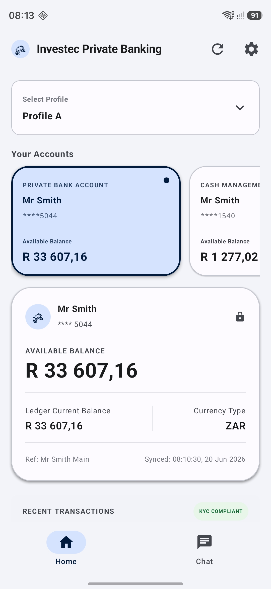
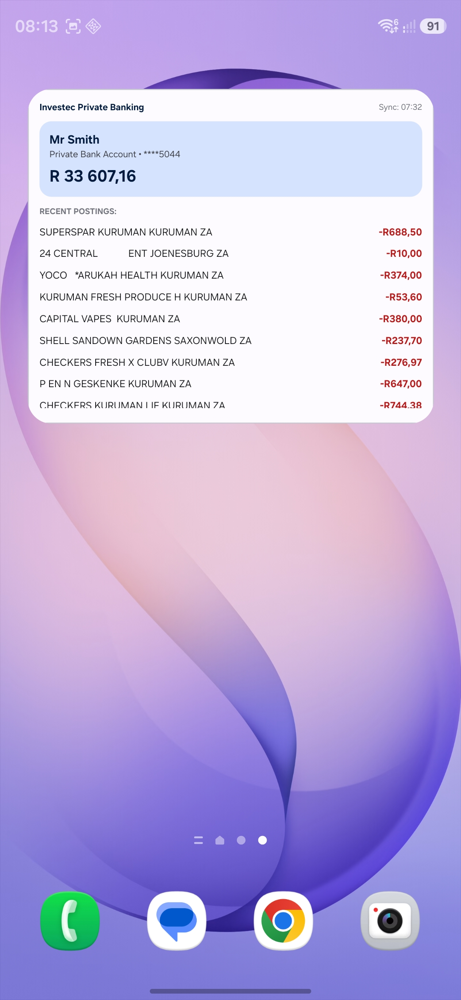
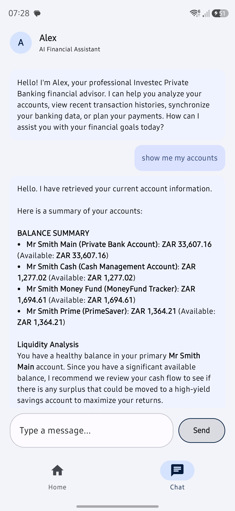

# Zebra Alex - Investec Private Banking AI Assistant App & Balance/Transactions Widget 

An offline-first Android application and Home Screen Widget for Investec Private Banking. It integrates secure local database caching, biometric security, a Jetpack Glance home screen widget, and an on-device AI assistant ("Alex") powered by Google LiteRT (formerly TensorFlow Lite) using Gemma.
<p align="center">
  
  
  
</p>


---

## 🚀 Key Features

- **🏦 Investec OpenAPI Integration**: 
  - Retrieves accounts, real-time balances, transaction postings, and credit cards.
  - Supports transferring funds and paying configured beneficiaries.
- **📴 Offline-First Room Caching**: 
  - Automatically caches accounts and transactions using Android Room to keep the app and home screen widget functional offline.
- **📱 Jetpack Glance Home Screen Widget**:
  - Displays primary account details, available balance, sync status, and recent postings (color-coded by credit/debit).
  - Integrates secure tap-to-unlock actions.
- **🔒 Biometric Security & Widget Auto-Locking**:
  - Access to sensitive financial info is protected using the Android Biometric prompt.
  - Automatically locks the home screen widget 5 seconds after exiting the app or when the screen turns off (via Android `AlarmManager`) to prevent unauthorized viewing.
- **🤖 On-Device AI Financial Assistant ("Alex")**:
  - Powered by **Google LiteRT-LM** running a local model (`gemma-4-E2B-it.litertlm` on device CPU, optimized with 4 threads).
  - Equipped with a `BankingToolSet` allowing you to query accounts, transaction history, and check balances using natural language in a secure, privacy-preserving chat interface.

---

## 🛠️ Project Structure

The codebase is organized into key modules:
- **`app/src/main/java/com/example/MainActivity.kt`**: [MainActivity.kt](file:///Users/nickc/AndroidStudioProjects/InvestecBankingWidget/app/src/main/java/com/example/MainActivity.kt) - Entry Activity handling biometric authentication, state management, widget alarm scheduling, and app navigation.
- **`app/src/main/java/com/example/ui/dashboard/`**:
  - [DashboardScreen.kt](file:///Users/nickc/AndroidStudioProjects/InvestecBankingWidget/app/src/main/java/com/example/ui/dashboard/DashboardScreen.kt) - Renders the main dashboard, including profile selections, account cards, transaction history lists, and secure settings management.
  - [DashboardViewModel.kt](file:///Users/nickc/AndroidStudioProjects/InvestecBankingWidget/app/src/main/java/com/example/ui/dashboard/DashboardViewModel.kt) - Manages account states, sync events, and interacts with the repository.
- **`app/src/main/java/com/example/ui/chat/`**:
  - [ChatScreen.kt](file:///Users/nickc/AndroidStudioProjects/InvestecBankingWidget/app/src/main/java/com/example/ui/chat/ChatScreen.kt) - Natural chat UI representing conversation bubbles.
  - [ChatViewModel.kt](file:///Users/nickc/AndroidStudioProjects/InvestecBankingWidget/app/src/main/java/com/example/ui/chat/ChatViewModel.kt) - Handles conversation context, LiteRT engine initialization, and streaming inferences.
- **`app/src/main/java/com/example/receiver/BankWidgetProvider.kt`**:
  - [BankWidgetProvider.kt](file:///Users/nickc/AndroidStudioProjects/InvestecBankingWidget/app/src/main/java/com/example/receiver/BankWidgetProvider.kt) - Logic for updating the Jetpack Glance Widget, evaluating biometric lock states, and checking session expiry.
- **`app/src/main/java/com/example/data/`**:
  - `ai/`: Contains [LiteRtEngineManager.kt](file:///Users/nickc/AndroidStudioProjects/InvestecBankingWidget/app/src/main/java/com/example/data/ai/LiteRtEngineManager.kt) (LM lifecycle) and [BankingToolSet.kt](file:///Users/nickc/AndroidStudioProjects/InvestecBankingWidget/app/src/main/java/com/example/data/ai/BankingToolSet.kt) (agent function calling registry).
  - `api/`: [InvestecApiService.kt](file:///Users/nickc/AndroidStudioProjects/InvestecBankingWidget/app/src/main/java/com/example/data/api/InvestecApiService.kt) - Retrofit network client configuration and service definitions for the Investec OpenAPI.
  - `local/`: Room Database configuration, Account and Transaction Entity DAOs.
  - `repository/`: [BankRepository.kt](file:///Users/nickc/AndroidStudioProjects/InvestecBankingWidget/app/src/main/java/com/example/data/repository/BankRepository.kt) - Managing data synchronization, credential accessors, database updates, and payments.
- **`app/src/main/assets/`**:
  - [system_prompt.txt](file:///Users/nickc/AndroidStudioProjects/InvestecBankingWidget/app/src/main/assets/system_prompt.txt) - The system instruction prompt defining rules, guidelines, and formatting styles for the AI assistant.

---

## ⚙️ Getting Started

### 1. Prerequisites
- **Android Studio** (Koala or newer recommended).
- **Android SDK 35/36** target compatibility.
- An emulator or physical device supporting **Biometric Authentication**.

### 2. Set Up Local Gemma Model (LiteRT)
The AI assistant runs a local language model. You must supply a compatible LiteRT model file:
1. Obtain the `gemma-4-E2B-it.litertlm` model. [Hugging Face](https://huggingface.co/google/gemma-4-E2B)
2. Push the model to the target device's local tmp directory via ADB:
   ```bash
   adb push path/to/gemma-4-E2B-it.litertlm /data/local/tmp/
   ```

### 3. Open API Credentials Setup
The application comes preconfigured to run in **Sandbox Mode** using open-access sandboxed credentials.
To connect to your live Investec accounts:
1. Open the app and tap the **Settings** (gear) icon in the top right.
2. Disable **Developer Sandbox Mode**.
3. Supply your **Client ID**, **Client Secret**, and **x-api-key** obtained from the [Investec Developer Portal](https://developer.investec.com/).
4. Tap **Apply & Sync** to fetch your actual accounts and transactions securely.

---

## 🧪 Testing

The project is fully integrated with:
- **Compose UI Tests** and **Robolectric** for local behavior verification.
- **Roborazzi** for screenshot testing.
- To run tests:
  ```bash
  ./gradlew test
  ```
---

## Roadmap

1. Android App and Widget
2. Android Watch Tile and LLM download option
3. iOS App
