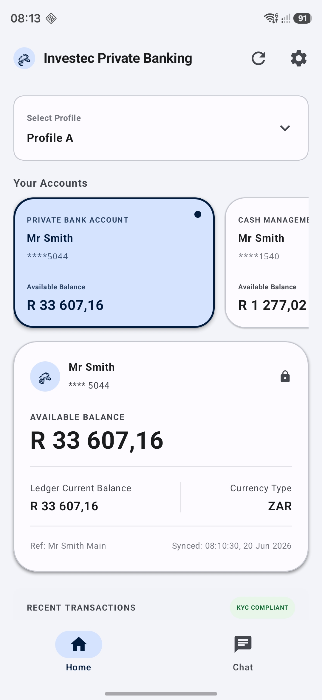
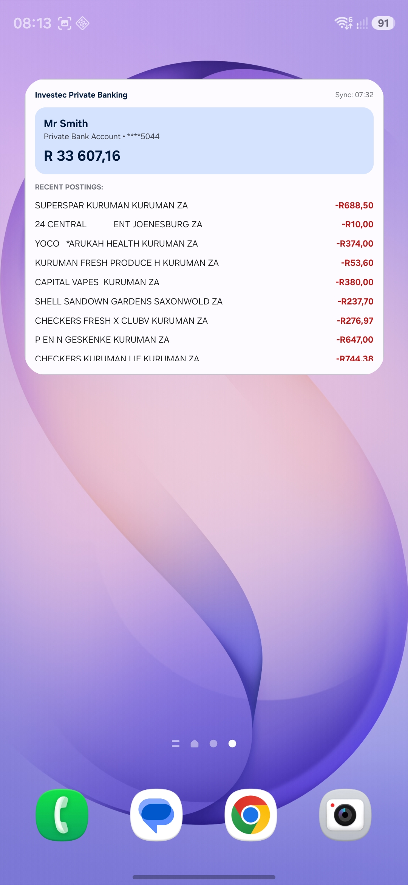
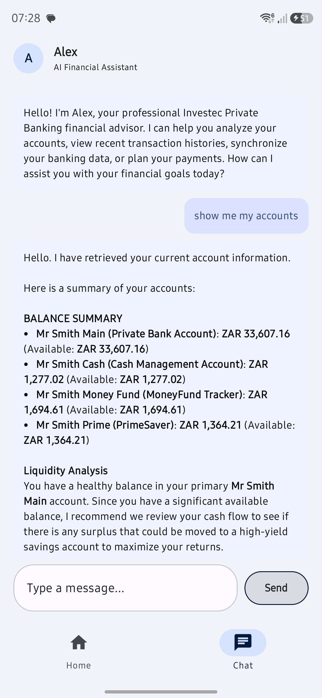

# Zebra Alex - Investec Private Banking AI Assistant & Multiplatform Suite

An offline-first Kotlin Multiplatform (KMP) application suite for Investec Private Banking, supporting **Android**, **Wear OS (App & Watch Tile)**, and **iOS (SwiftUI)**. It integrates secure local database caching, biometric security, a Jetpack Glance home screen widget, Wear OS smartwatch tiles, and an on-device AI assistant ("Alex") powered by Google LiteRT (formerly TensorFlow Lite) using Gemma.

<p align="center">
  
  
  
</p>

---

## 🚀 Key Features

- **🌐 Kotlin Multiplatform (KMP) Architecture**:
  - Centralized shared data layer (`shared/`) providing unified Room DB caching, API client, models, and repositories for Android, Wear OS, and iOS targets.
- **⌚ Wear OS Smartwatch App & Watch Tile**:
  - Native Wear OS UI built with Wear Compose featuring account balance viewing, transaction history, and custom connection settings.
  - Quick-glance Wear OS Watch Tile ([BankTileService.kt](file:///Users/nickc/AndroidStudioProjects/InvestecBankingWidget/wear/src/main/java/com/example/tile/BankTileService.kt)).
  - Automated background credential sync from handheld Android app via Google Wearable DataLayer ([WearSettingsSyncHelper.kt](file:///Users/nickc/AndroidStudioProjects/InvestecBankingWidget/shared/src/androidMain/kotlin/com/example/data/sync/WearSettingsSyncHelper.kt)).
- **🍎 Native iOS Application**:
  - Built with SwiftUI in `iosApp/` consuming the KMP shared framework for consistent financial data, caching, and custom dark UI styling across platforms.
- **🏦 Investec OpenAPI Integration**: 
  - Retrieves accounts, real-time balances, transaction postings, and credit cards.
  - Supports transferring funds and paying configured beneficiaries.
- **📴 Offline-First Room Caching**: 
  - Automatically caches accounts and transactions using Room to keep all apps, widgets, and tiles functional offline.
- **📱 Jetpack Glance Home Screen Widget**:
  - Android home screen widget displaying primary account details, available balance, sync status, and color-coded transaction history.
- **🔒 Biometric Security & Widget Auto-Locking**:
  - Access to sensitive financial info is protected using the Android Biometric prompt.
  - Automatically locks the home screen widget 5 seconds after exiting the app or when the screen turns off (via Android `AlarmManager`) to prevent unauthorized viewing.
- **🤖 On-Device AI Financial Assistant ("Alex")**:
  - Powered by **Google LiteRT-LM** running local model (`gemma-4-E2B-it.litertlm` on device CPU, optimized with 4 threads).
  - Equipped with a `BankingToolSet` allowing you to query accounts, transaction history, and check balances using natural language in a secure, privacy-preserving chat interface.

---

## 🛠️ Project Structure

The codebase is organized into key modules:

- **`shared/`**: KMP Shared Core Module
  - [InvestecApiService.kt](file:///Users/nickc/AndroidStudioProjects/InvestecBankingWidget/shared/src/commonMain/kotlin/com/example/data/api/InvestecApiService.kt) - Ktor/Retrofit API client configuration and service definitions for the Investec OpenAPI.
  - [BankDatabase.kt](file:///Users/nickc/AndroidStudioProjects/InvestecBankingWidget/shared/src/commonMain/kotlin/com/example/data/local/BankDatabase.kt) - Multiplatform Room Database configuration & DAOs.
  - [BankRepository.kt](file:///Users/nickc/AndroidStudioProjects/InvestecBankingWidget/shared/src/commonMain/kotlin/com/example/data/repository/BankRepository.kt) - Data synchronization, database updates, credential accessors, and payments.
  - [WearSettingsSyncHelper.kt](file:///Users/nickc/AndroidStudioProjects/InvestecBankingWidget/shared/src/androidMain/kotlin/com/example/data/sync/WearSettingsSyncHelper.kt) - Syncs settings & credentials with Wear OS devices.
- **`app/`**: Handheld Android Application
  - [MainActivity.kt](file:///Users/nickc/AndroidStudioProjects/InvestecBankingWidget/app/src/main/java/com/example/MainActivity.kt) - Entry Activity handling biometric authentication, state management, widget alarm scheduling, and app navigation.
  - [DashboardScreen.kt](file:///Users/nickc/AndroidStudioProjects/InvestecBankingWidget/app/src/main/java/com/example/ui/dashboard/DashboardScreen.kt) - Main dashboard UI including profiles, account cards, transaction history, and settings.
  - [ChatScreen.kt](file:///Users/nickc/AndroidStudioProjects/InvestecBankingWidget/app/src/main/java/com/example/ui/chat/ChatScreen.kt) & [ChatViewModel.kt](file:///Users/nickc/AndroidStudioProjects/InvestecBankingWidget/app/src/main/java/com/example/ui/chat/ChatViewModel.kt) - AI Assistant chat UI and LiteRT engine lifecycle management.
  - [BankWidgetProvider.kt](file:///Users/nickc/AndroidStudioProjects/InvestecBankingWidget/app/src/main/java/com/example/receiver/BankWidgetProvider.kt) - Jetpack Glance Widget provider, biometric lock evaluation, and session expiry checks.
- **`wear/`**: Wear OS Smartwatch Application
  - [BankTileService.kt](file:///Users/nickc/AndroidStudioProjects/InvestecBankingWidget/wear/src/main/java/com/example/tile/BankTileService.kt) - Smartwatch tile provider for account overview and balances.
  - [WearBankingAppUi.kt](file:///Users/nickc/AndroidStudioProjects/InvestecBankingWidget/wear/src/main/java/com/example/wear/presentation/WearBankingAppUi.kt) - Wear Compose UI entry point.
  - `transactions/`: Screens for Account Picker, Transactions List, Details, and Connection Settings.
  - [WearSettingsListenerService.kt](file:///Users/nickc/AndroidStudioProjects/InvestecBankingWidget/wear/src/main/java/com/example/wear/service/WearSettingsListenerService.kt) - Listens for incoming credential sync events from the Android handheld app.
- **`iosApp/`**: Native iOS Application
  - [ContentView.swift](file:///Users/nickc/AndroidStudioProjects/InvestecBankingWidget/iosApp/iosApp/ContentView.swift) - SwiftUI user interface consuming the KMP `shared` framework.

---

## ⚙️ Getting Started

### 1. Prerequisites
- **Android Studio** (Koala or newer recommended).
- **Xcode** (15+ for running the iOS target).
- **Android SDK 35/36** target compatibility.
- An emulator or physical device supporting **Biometric Authentication**.

### 2. Set Up Local Gemma Model (LiteRT)
The AI assistant runs a local language model. You must supply a compatible LiteRT model file:
1. Obtain the `gemma-4-E2B-it.litertlm` model from [Hugging Face](https://huggingface.co/google/gemma-4-E2B).
2. Push the model to the target device's local tmp directory via ADB:
   ```bash
   adb push path/to/gemma-4-E2B-it.litertlm /data/local/tmp/
   ```

### 3. Open API Credentials Setup
The application comes preconfigured to run in **Sandbox Mode** using open-access sandboxed credentials.
To connect to your live Investec accounts:
1. Open the app and tap the **Settings** (gear) icon in the top right.
2. Disable **Developer Sandbox Mode**.
3. Supply your **Client ID**, **Client Secret**, and **x-api-key** obtained from the [Investec Developer Portal](https://developer.investec.com/).
4. Tap **Apply & Sync** to fetch your actual accounts and transactions securely.

### 4. Building Project Targets
- **Android Handheld App**: `./gradlew :app:assembleDebug`
- **Wear OS Smartwatch App**: `./gradlew :wear:assembleDebug`
- **iOS App**: Open `iosApp/iosApp.xcodeproj` in Xcode and build/run `iosApp`.

---

## 🧪 Testing

The project is integrated with:
- **Compose UI Tests** and **Robolectric** for local behavior verification.
- **Roborazzi** for screenshot testing.
- To run unit and viewmodel tests:
  ```bash
  ./gradlew test
  ```

---

## 🗺️ Roadmap Status

- [x] **Android App & Jetpack Glance Widget**
- [x] **Kotlin Multiplatform (KMP) Shared Data Core**
- [x] **Wear OS Smartwatch App & Watch Tile**
- [x] **iOS Native SwiftUI Application**
